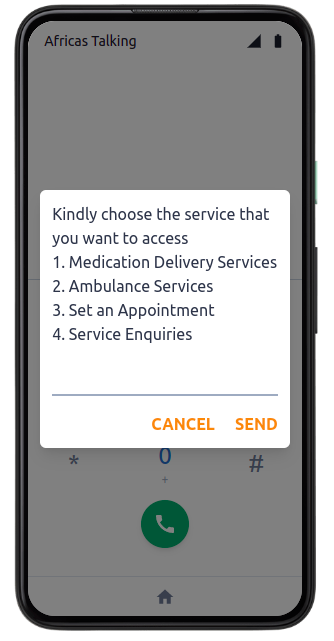

## USSD FUNCTIONALITY ##

# KeywordsMeaning #

- $sessionId: This generates a unique value when the session starts and sent every time a mobile subscriber response has been received.
- $serviceCode: This refer to your USSD code
 - $text: This shows the user input. which is an empty string in the first notification of a session which after that concatenates all the user input within the session until the session ends.
- $response: This hold the answer to the user input.
- echo: Prints out the response for the user to read.
- CON: It means an intermediate menu Or that the session is CONtinuing
- END: Means the final menu and will trigger session termination i.e session is ENDing.

A user will be able to access the ussd through dialing  **[*384*67947#]** and a menu shall pop up for the user to be able to order a medicine or request for ambulance services.

[Africas Talking](https://africastalking.com/)  sandbox simulator has been used  as it is  provided freely. First the simple ussd has been deployed on [heroku](https://ussd-enigma.herokuapp.com/) and later on the deployed link used on a simulator on a specific channel.

